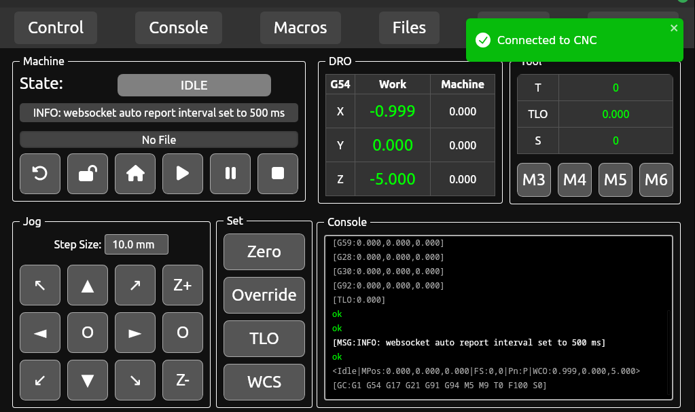
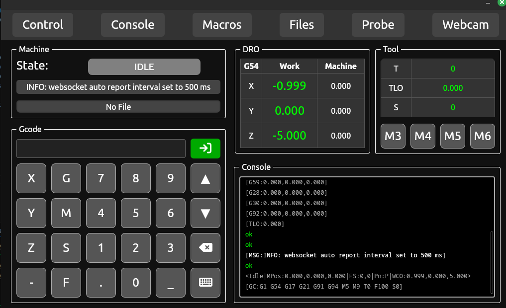
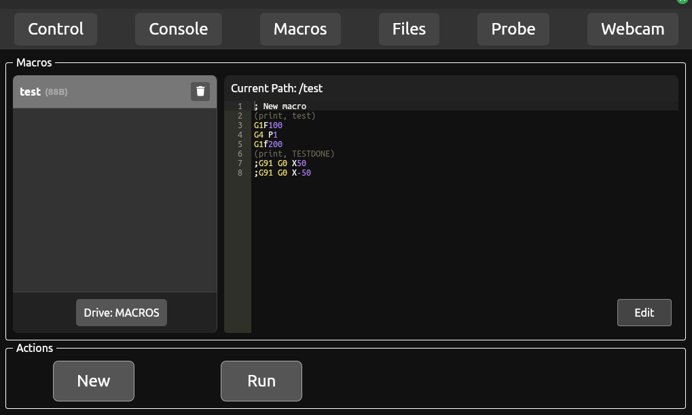
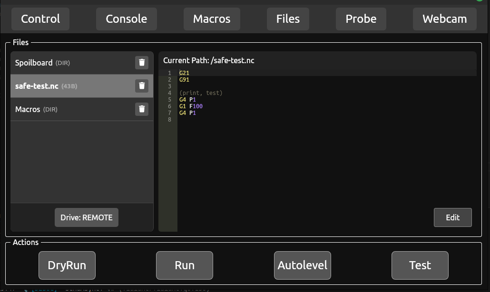
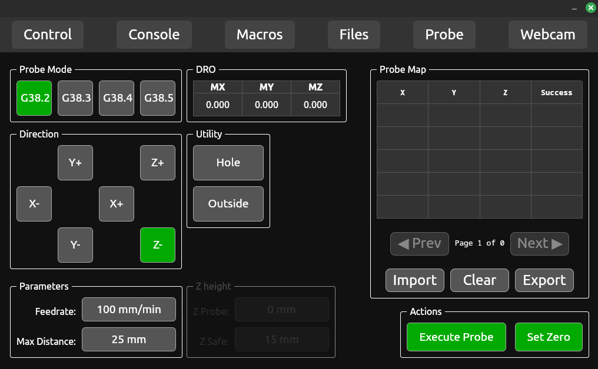

This is a wails + react frontend for CNC control designed to run on a Raspberry Pi with a 7 inch touchscreen. I have tried to make the application easy to expand to support additional controllers and connection types, however I currently only have a FluidNC controller and a small desktop CNC to dev/test with. 

# Warning
I am not a web developer nor am I an expericened CNC machine operator. This is a hobby project I am using to learn GUI/frontend development. The application is functional, but I have not done much testing. If you use this, do so at your own risk, and pay attention to what your machine is doing. If you find bugs or problems feel free to create an issue but as this is a hobby project, my dev time is limited.

# BugFix TODO
- [x] app slows down after a while, i think consoleMessages gets big. Capped it at 50 to test.
- [ ] lag is awful, lazyload makes pages slow, non lazyload makes everything slow.
- [ ] need a heartbeat to detect hangs
- [ ] disable tooltips wails or OS. they are annoying


## Features
- [x] Websocket provider
- [ ] socket.io provider 
- [ ] Telnet provider
- [ ] UART provider (raw PI)
- [x] FluidNC Controller
- [ ] CNCJs Controller
- [ ] Generic Grbl controller
- [x] View, Edit, Run Gcode files from local fs (PI), USB, and on controller storage when supported (FluidNC) 
- [x] Probing controls + some utility functions like probe hole
- [x] Macros
- [x] Console
- [ ] Autoleveling 
- [x] Webcam viewer with crosshair and position overlay
- [x] Easy use G54-G59 work offsets
- [x] Spindle control and TLO setting
- [x] Realtime Overrides (note this is currently hard coded for Grbl style controllers. This will need implmentation in the controller interface for other controllers but I have none to test with)

## TODO
- [ ] Implement controller specific overrides
- [ ] stream issues ???:
- [x] non remote streams dont update job status
- [ ] implement autolevel functionlity
- [ ] clean up CNCContext, most of the funcs can be removed and called directly via the go exports
- [ ] add probe grid to probe utils

- [x] move connections to a provider interface.
- [x] revamp all controller (fluidnc) file functionality
- [x] fluidnc initial report request happens before full connection is ready
- [x] fluidnc connection status is not quite right
- [x] I do not like the current file functionality/code layout
- [x] add import/export to probe history
- [x] Break up run explorer group. make seperate components for file browser, file viewer.
- [x] allow editing Gcode files
- [x] change the zerobutton group. make this a util group. zero button shows axis select. then we can add overides
- [x] need a way to display file progress


# Building on Pi
I have been unable to successfully cross compile this wails app from my linux host, so building will need to be done on the Pi.
```
# ensure that Wails and Node are installed, Im using npm@10.9.0, node@v20.18.3 via NVM

git clone https://github.com/redt1de/go2cnc
cd go2cnc
cd frontend
npm install react-ace @fortawesome/free-solid-svg-icons @fortawesome/ react-fontawesome react-router-dom react-toastify
cd ..
wails build -clean

DISPLAY=:0 build/bin/go2cnc -config ./config.yaml
    or
DISPLAY=:0 wails dev
```

#### Control Page

#### Console Page

#### Macros Page

#### Files Page

#### Probe Page

